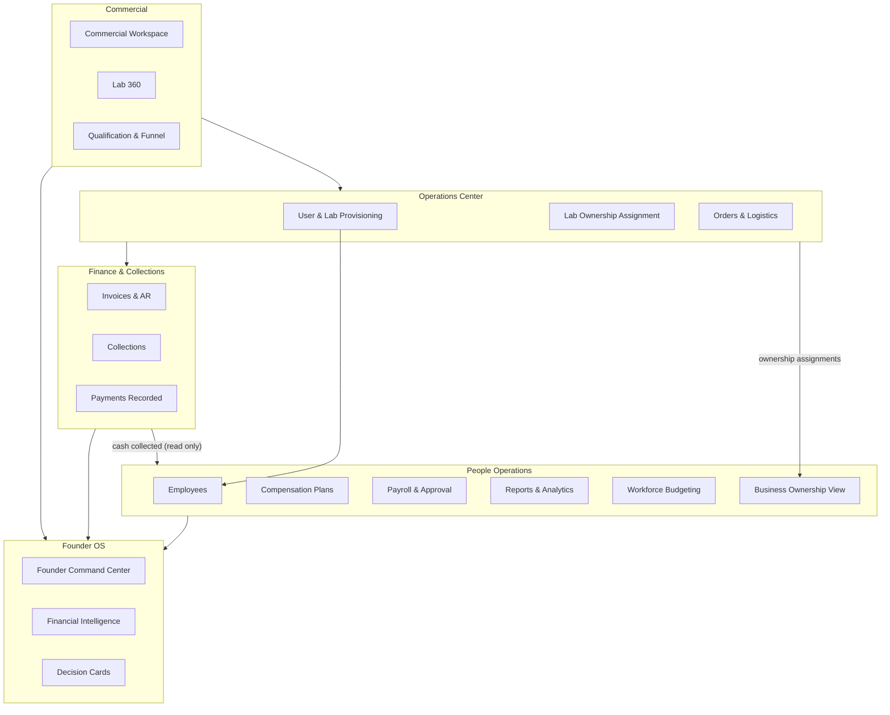
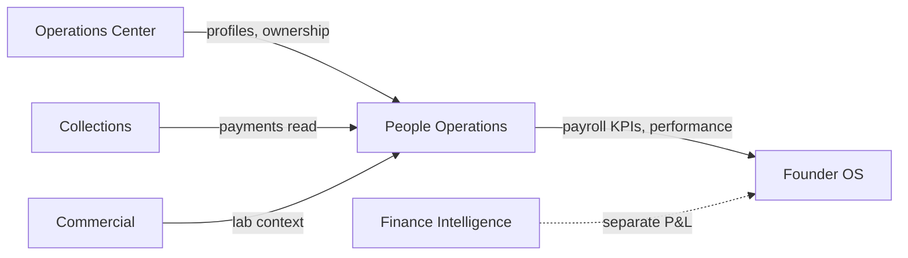

# 01 — PrimeCare Enterprise Map

**Audience:** Founder, executive team, board advisors  
**Purpose:** One-page mental model of how PrimeCare modules connect

---

## The idea in one sentence

PrimeCare runs **field sales and lab relationships** (Commercial + Operations), records **money collected** (Finance + Collections), and pays **HQ field teams** fairly based on **cash collected** (People Operations) — with the **Founder OS** giving you decision-ready visibility across all of it.

---

## PrimeCare Enterprise Map



---

## What each area owns

| Area | Business job | Examples |
|------|----------------|----------|
| **Commercial** | Win and manage lab relationships | Territory view, lab qualification, visit history, contract status |
| **Operations Center** | Run the business day-to-day | Create users, assign lab ownership, process orders, logistics |
| **Finance & Collections** | Record what was sold and what was collected | Invoices, receivables, payment recording, allocation |
| **People Operations** | Pay HQ field teams correctly | Employee directory, pay plans, payroll preview, executive approval |
| **Founder OS** | Executive visibility and decisions | Cross-module KPIs, performance cards, strategic readouts |

---

## The golden rule: one source of truth per concern

| Business concern | Where truth lives | People Operations role |
|------------------|-------------------|------------------------|
| Who works for us | **Operations Center** (user profiles) | **Reads** employee list; does not create users |
| Who owns which lab | **Operations Center** (`lab_ownership`) | **Reads** ownership for reporting; does not change assignments |
| What was ordered / invoiced | **Orders / Invoices** | **Does not touch** |
| What cash was collected | **Collections / Payments** | **Reads** for commission; **does not record** payments |
| How much someone earns | **People Operations** (plans + payroll) | **Owns** pay rules and approved payroll runs |
| Company P&L / GL | **Finance** (future) | **Does not post** to accounting |

---

## People Operations in the enterprise picture

People Operations sits **after** Commercial and Collections in the business story:

```
Lab relationship  →  Order  →  Invoice  →  Payment collected
                                              ↓
                                    Commission calculated
                                              ↓
                                    Payroll preview & approval
```

It is **not** where you record collections. It is where you **turn collection results into pay**.

---

## Who uses what (simplified)

| Role | Typical modules | People Operations access |
|------|-----------------|--------------------------|
| **Founder / Executive** | Founder OS, Finance, People Operations | Full view + approve payroll |
| **Admin** | Operations Center, Collections | View People Ops; recommend only |
| **HR** | People Operations | Generate payroll preview; assign plans; cannot final-approve |
| **Agent** | Visits, Collections | No People Ops menu (own pay view planned separately) |
| **Lab** | Lab portal | No People Operations access |

---

## How modules talk to each other (without changing each other's data)



**Solid arrows** = People Operations reads data.  
**Dotted** = related but separate (company finance vs payroll envelope).

---

## What Year 1 includes vs roadmap

### In scope today (People Operations v1.0)

- Employee directory and Employee 360 view
- Compensation plan design and assignments
- Payroll preview, approval workflow, export metadata
- Business ownership **read** view (who covers which lab)
- Workforce budgeting **planning** view (not company GL)
- Executive reports and analytics

### Roadmap (not v1.0)

- Bank file generation and actual disbursement
- General ledger posting
- Leave, benefits, recruiting, org charts
- Agent self-service "My Pay" in mobile menu
- Editing ownership from People Operations (stays in Operations Center)

---

## Founder takeaway

Think of PrimeCare as **four engines**:

1. **Sell** (Commercial)  
2. **Operate** (Operations Center)  
3. **Collect** (Finance / Collections)  
4. **Pay** (People Operations)  

Founder OS sits **above** all four and answers: *"Is the business healthy, and are we paying people fairly for cash collected?"*

---

## Next read

→ [02_People_Operations_Business_Walkthrough.md](./02_People_Operations_Business_Walkthrough.md)
