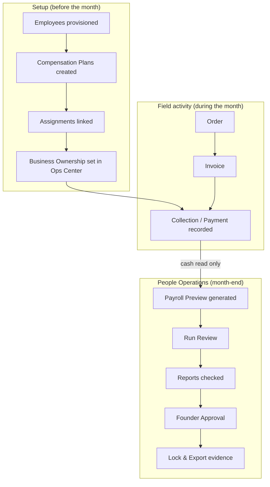
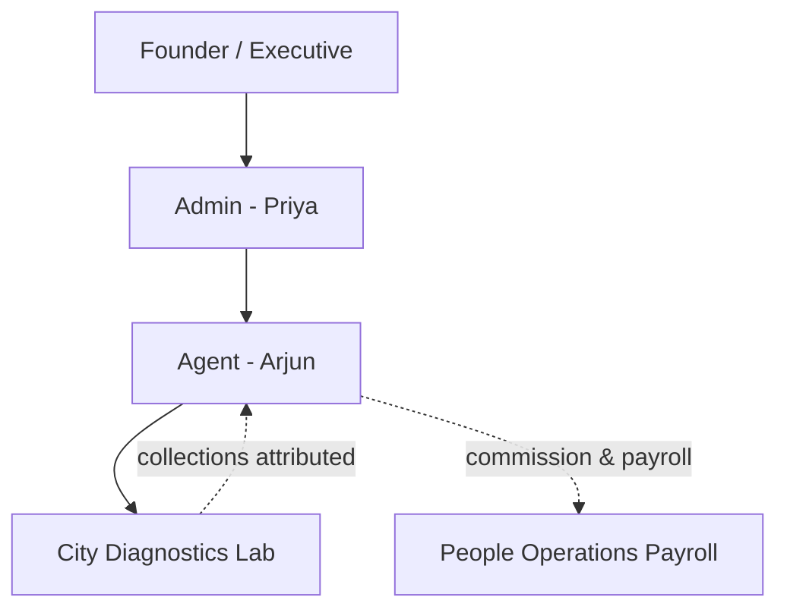
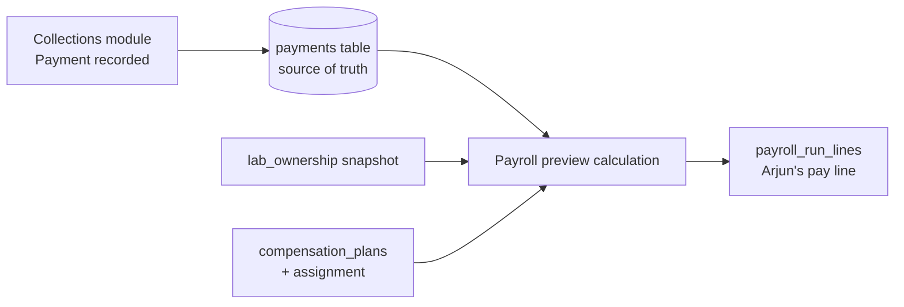
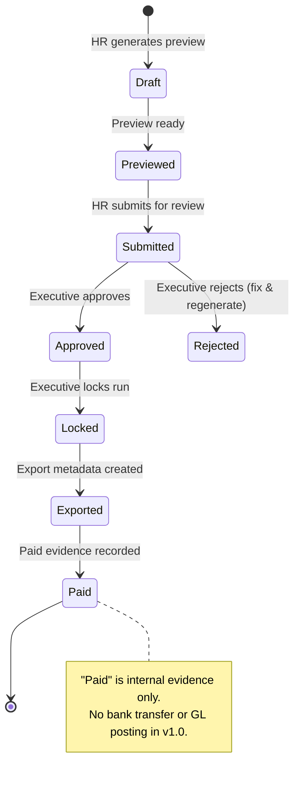

# 02 — People Operations Business Walkthrough

**Audience:** Founder, executive team, HR, finance partners  
**Purpose:** Explain People Operations as a business system — using a realistic field example

---

## The business story (read this first)

PrimeCare pays HQ field teams based on **cash actually collected** — not on orders placed, invoices sent, or receivables outstanding.

The business flow is:

```
Employees
    ↓
Compensation Plans  (how each role gets paid)
    ↓
Business Ownership  (which agent covers which lab)
    ↓
Collections  (cash recorded against labs)
    ↓
Payroll  (preview, review, approve)
    ↓
Reports  (did we pay fairly? who performed?)
    ↓
Founder Approval  (executive sign-off before lock & export)
```

People Operations is the **HQ command center** for everything from **Employees** through **Founder Approval**. Collections themselves are recorded in the **Collections** module — People Operations **consumes** that data for commission and pay.

---

## Realistic example: one month in the field

Meet the cast:

| Person / thing | Role in the story |
|----------------|-------------------|
| **Ravi (Founder / Executive)** | Approves payroll; sees Founder OS performance |
| **Priya (Admin)** | Runs Operations Center; assigns lab ownership |
| **Arjun (Agent)** | Visits labs, drives collections |
| **City Diagnostics Lab** | Customer lab |
| **Order #1042** | Lab places an order for supplies |
| **Invoice** | Billed amount (not yet commissionable until cash collected) |
| **Payment / Collection** | ₹85,000 cash collected and recorded in Collections |
| **Commission** | Calculated from collected cash per Arjun's plan |
| **Payroll approval** | Ravi reviews and approves the monthly payroll run |

### Step-by-step (business language)

1. **Priya** provisions **Arjun** as an agent in **Operations Center** → he appears in **People Operations → Employees**.
2. **Ravi** (or HR) creates a compensation plan **"Agent Year 1"** — base salary, fuel, mobile, commission rate → **Compensation → Plans**.
3. **Arjun** is assigned to that plan → **Compensation → Assignments**.
4. **Priya** assigns **Arjun** as primary agent for **City Diagnostics Lab** → **Operations Center** (ownership write). **People Operations → Business Ownership** shows the chain: Executive → Admin → Agent → Lab.
5. **City Diagnostics** places **Order #1042** → fulfilled and invoiced (Operations / Finance — not People Ops).
6. **Arjun** collects **₹85,000** → recorded as a **payment** in **Collections** (Finance boundary — People Ops does not create this row).
7. At month-end, **HR** generates a **payroll preview** in **People Operations → Payroll**. The system calculates Arjun's salary + commission from **cash collected** attributed to him for that period.
8. **Ravi** reviews the run in **Payroll → Run Review**, checks **Reports** for fairness, then **approves** and **locks** the payroll.
9. **Founder OS** reflects payroll liability and field performance for Ravi's decisions.

---

## Master diagram: People Operations Flow



---

## Diagram: Employee-to-Lab Ownership Chain

This is what **Business Ownership** shows. Assignments are made in **Operations Center**; People Operations **displays** the chain.



**Business meaning:** When cash is collected at City Diagnostics, PrimeCare knows **which agent** should get credit — based on ownership at the time of collection, not a guess.

---

## Diagram: Collection-to-Compensation Flow



**Key rule:** Commission uses **cash collected**, not invoice amount or open receivables.

---

## Diagram: Payroll Approval Flow



| Stage | Who typically acts | Business meaning |
|-------|-------------------|------------------|
| Draft / Previewed | HR | Numbers calculated; not yet submitted |
| Submitted | HR | Ready for executive review |
| Approved | **Founder / Executive** | Leadership accepts the pay run |
| Locked | Executive | Run becomes immutable |
| Exported | Executive | Export record for downstream payroll processing |
| Paid | Executive | Evidence that pay was disbursed (external process) |

---

## Each People Operations tab — business guide

For each tab: **why it exists**, **question it answers**, **data**, **allowed / not allowed actions**, **connections**, **founder UAT check**.

---

### Dashboard

| | |
|---|---|
| **Why it exists** | Single place to see "where are we in the payroll cycle?" and what needs attention today. |
| **Business question** | *What should I act on right now?* |
| **Data used** | Current payroll period, run status, employee counts, work inbox (approvals/alerts), recent activity. |
| **Allowed** | Navigate to Payroll, Employees, inbox items; use quick actions (e.g. open payroll, generate preview if HR). |
| **Not allowed** | Record collections; change ownership; edit invoices; post to accounting. |
| **Connects to** | **Payroll** (actions), **Founder OS** (summary KPIs), **Commercial** (indirect via performance context). |
| **Founder UAT check** | KPI strip matches selected period; inbox items are actionable; no duplicate period controls (use Context widget). |

---

### Employees

| | |
|---|---|
| **Why it exists** | HQ workforce directory — who works for us and under which pay plan. |
| **Business question** | *Who is on the team, and are they assigned a compensation plan?* |
| **Data used** | User profiles (from Operations Center), plan assignments, payroll status for current run. |
| **Allowed** | Search/filter, open **Employee 360** (pay history, plan, commission), export list, route to assign plan. |
| **Not allowed** | Create or deactivate users (→ **Operations Center**); change collections or orders. |
| **Connects to** | **Operations Center** (provisioning), **Compensation** (assignments), **Payroll** (who appears in run). |
| **Founder UAT check** | Every active agent has a plan or clear "unassigned" warning; 360 drawer opens and shows pay context. |

---

### Compensation — Plans

| | |
|---|---|
| **Why it exists** | Define **how** each role gets paid (salary, allowances, commission rate, promotion rules). |
| **Business question** | *What are our pay rules for agents, admins, and executives?* |
| **Data used** | `compensation_plans` (versioned rules). |
| **Allowed** | Executive: create, edit, activate, deactivate, duplicate plans. HR/Admin: view (Admin read-only). |
| **Not allowed** | Run payroll from here; change collected cash; edit commission on past locked runs. |
| **Connects to** | **Payroll** (rules drive calculation), **Reports** (plan distribution), **Founder OS** (compensation intelligence). |
| **Founder UAT check** | Active plans match your Year 1 field policy; draft plans flagged in data quality banner. |

---

### Compensation — Assignments

| | |
|---|---|
| **Why it exists** | Link each **employee** to the **plan** they earn under. |
| **Business question** | *Who is on which pay plan, starting when?* |
| **Data used** | `compensation_plan_assignments`, employee profiles. |
| **Allowed** | Executive/HR: assign, change plan (preserves history), end assignment. |
| **Not allowed** | Delete history; assign without active plan; modify finance records. |
| **Connects to** | **Employees** (directory), **Payroll** (which plan applies per person in preview). |
| **Founder UAT check** | Arjun (test agent) shows active assignment; unassigned employees trigger warning. |

---

### Business Ownership

| | |
|---|---|
| **Why it exists** | Show **who covers which lab** in the sales chain — critical for attributing collections and commission. |
| **Business question** | *For any lab, who is responsible, and are there gaps?* |
| **Data used** | `lab_ownership` (read-only here), lab list, collection rollups. |
| **Allowed** | Explore hierarchy, search labs/agents, open Lab 360, view coverage % and gaps. |
| **Not allowed** | **Change ownership** (→ **Operations Center**); edit payroll; record payments. |
| **Connects to** | **Commercial** (lab relationships), **Operations Center** (ownership writes), **Collections** (attribution context), **Payroll** (commission attribution). |
| **Founder UAT check** | City Diagnostics shows Arjun in chain; coverage bar reflects reality; gaps listed if any lab unassigned. |

---

### Collections (related module — not a People Ops tab)

| | |
|---|---|
| **Why it exists** | Record **cash collected** from labs — the input for commission. |
| **Business question** | *How much cash did we actually receive?* |
| **Data used** | `payments`, allocations, AR context. |
| **Allowed in Collections** | Record payment, notes, collection workflow (role-dependent). |
| **Not allowed in People Ops** | People Operations **never** creates or edits payment rows. |
| **Connects to** | **People Operations → Payroll** (commission input), **Finance** (reconciliation). |
| **Founder UAT check** | After recording ₹85,000 test payment, payroll preview shows commission impact for Arjun (next cycle). |

---

### Payroll — Periods

| | |
|---|---|
| **Why it exists** | Manage monthly payroll **cycles** — one row per period (e.g. July 2026). |
| **Business question** | *Which months have we run payroll for, and what stage are they in?* |
| **Data used** | `payroll_periods`, `payroll_runs`. |
| **Allowed** | HR: generate preview. Executive: open run review, workflow actions. |
| **Not allowed** | Skip approval stages; mutate collections; auto-pay bank. |
| **Connects to** | **Dashboard** (status), **Reports** (trends by period). |
| **Founder UAT check** | Current month visible; status badge matches workflow stage. |

---

### Payroll — Run Review

| | |
|---|---|
| **Why it exists** | Line-by-line review of **every employee's pay** before executive approval. |
| **Business question** | *Is this payroll correct before I approve it?* |
| **Data used** | `payroll_run_lines`, compensation plans, collected cash attribution. |
| **Allowed** | Executive: approve, reject, lock, export, mark paid. HR: submit preview. Filter/sort lines; open Employee 360. |
| **Not allowed** | Edit locked runs; create payments; change ownership retroactively without process. |
| **Connects to** | **Compensation** (plans), **Collections** (commission source), **Founder Approval** (this is where you sign off). |
| **Founder UAT check** | Arjun's line shows salary + commission; empty run says "No employees in this payroll version" not misleading zeros; sticky totals match detail. |

---

### Payroll — Commission Ledger / Activity / Exports

| | |
|---|---|
| **Why it exists** | **Ledger:** commission audit trail. **Activity:** who did what in payroll. **Exports:** evidence of locked run export. |
| **Business question** | *Can we audit how commission was calculated and who approved what?* |
| **Data used** | `compensation_commission_entries`, `compensation_audit_events`, `payroll_exports`. |
| **Allowed** | Read-only review. |
| **Not allowed** | Edit audit history; regenerate export without workflow. |
| **Connects to** | **Finance** (future reconciliation), **Founder OS** (governance). |
| **Founder UAT check** | After preview, ledger shows entries; activity logs workflow steps. |

---

### Budgeting

| | |
|---|---|
| **Why it exists** | **Plan** workforce cost — envelope around payroll, not company-wide P&L. |
| **Business question** | *Are we within our workforce budget for this period?* |
| **Data used** | Derived from current payroll + planning assumptions (session-based scenarios). |
| **Allowed** | View KPIs, scenarios, headcount planning (session only — not saved to finance GL). |
| **Not allowed** | Change actual payroll; post budget to accounting; mutate finance tables. |
| **Connects to** | **Finance** (separate company budget), **Payroll** (actuals input), **Founder OS** (cost visibility). |
| **Founder UAT check** | Shows "Budget not configured" when no preview exists; charts hidden when no data. |

---

### Reports

| | |
|---|---|
| **Why it exists** | Executive analytics — trends, rankings, promotion pipeline, territory performance. |
| **Business question** | *Are we paying fairly? Who are top performers? Where are risks?* |
| **Data used** | Payroll intelligence, collection efficiency, employee metrics (read models). |
| **Allowed** | Read-only analysis; navigate to Payroll from empty states. |
| **Not allowed** | Workflow actions; editing underlying data. |
| **Connects to** | **Founder OS** (performance panels), **Commercial** (territory/lab context), **Payroll** (source periods). |
| **Founder UAT check** | Executive summary appears before charts; empty periods show "Open Payroll" not blank graphs. |

---

### Settings

| | |
|---|---|
| **Why it exists** | Future home for payroll policies, export templates, calendars — v1.0 separates **active** vs **roadmap**. |
| **Business question** | *What can we configure today vs later?* |
| **Data used** | Mostly static guidance; live config via Payroll workflow today. |
| **Allowed** | Read roadmap; understand active paths (Pay Cycles via Payroll, Approval via workflow). |
| **Not allowed** | Expect bank file / GL config here in v1.0. |
| **Connects to** | **Operations Center**, **Payroll** (real config today). |
| **Founder UAT check** | Clear labeling of "Active" vs "Roadmap" — no false promises. |

---

### Founder Approval (cross-cutting)

| | |
|---|---|
| **Why it exists** | Governance — payroll is immaterial; executive must explicitly approve before lock. |
| **Business question** | *Has leadership signed off on this pay run?* |
| **Where it happens** | **Payroll → Run Review** workflow toolbar; **Dashboard** work inbox. |
| **Allowed** | Executive: approve, reject, lock, export, paid evidence. |
| **Not allowed** | HR final approval; bypass lock; automatic bank payment. |
| **Connects to** | **Founder OS** (decision context), **Finance** (future disbursement handoff). |
| **Founder UAT check** | Only executive role sees Approve/Lock; audit trail records actor and timestamp. |

---

## How People Operations connects to other products

| Product | Connection |
|---------|------------|
| **Commercial** | Lab and territory context; Lab 360 overlaps with ownership performance |
| **Finance** | Reads payments; never writes invoices/AR; separate P&L in Executive Financial Intelligence |
| **Operations Center** | Source of employees and ownership; People Ops is read-only for both |
| **Collections** | Source of cash for commission; recorded only in Collections |
| **Founder OS** | Consumes payroll KPIs, performance cards, hierarchical compensation views |

---

## Common founder questions

**Q: Can I change commission by editing a payment in People Operations?**  
A: No. Payments are recorded in Collections. People Operations reads them.

**Q: Does "Mark Paid" send money to employees?**  
A: No. It records that payroll was disbursed externally. Bank integration is roadmap.

**Q: Why can't I assign a lab to an agent in Business Ownership?**  
A: Ownership changes are operational actions — done in Operations Center to keep one source of truth.

**Q: What's the difference between Commission Management menu and People Operations?**  
A: Commission Management is the legacy growth engine. People Operations payroll uses the HQ compensation engine and cash-collected rules for **payroll**.

---

## Next read

→ [03_People_Operations_UAT_Guide.md](./03_People_Operations_UAT_Guide.md)
