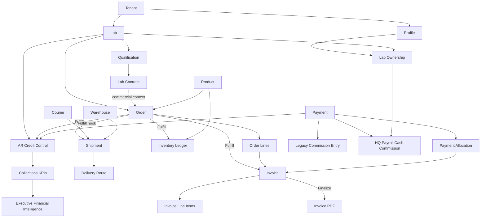
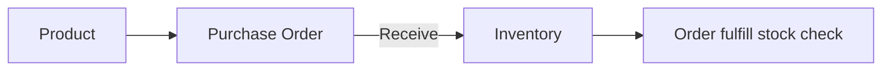

# 03 — Object Dependency Graph

**Upstream/downstream relationships for Year-1 Order-to-Cash certification.**

Use this graph to determine **certification order**: upstream objects must be GREEN before downstream sign-off.

Blueprint ref: [02_Object_Relationships.md](../PrimeCare_System_Blueprint/02_Object_Relationships.md)

---

## O2C primary chain



---

## Layer model

| Layer | Objects | Cert priority |
|-------|---------|---------------|
| **L0 Platform** | Tenant, Profile | 1 — auth + scope |
| **L1 Master** | Lab, Product, AR row, Qualification, Contract | 2 — master data |
| **L2 Transaction** | Order, Order lines | 3 — order create |
| **L3 Fulfill** | Inventory ledger, Invoice, Shipment | 4 — fulfill chain |
| **L4 Logistics** | Courier, Route, Delivery charge snapshot | 5 — ops delivery |
| **L5 Cash** | Payment, Allocation, AR update | 6 — collections |
| **L6 Intelligence** | EFI, Revenue funnel, legacy Commission | 7 — read-only analytics |
| **L7 Compensation** | Payroll period, payroll run, payroll run line, cash commission, adjustment, export metadata | 8 — Executive approval workflow |

---

## Dependency matrix (downstream requires upstream)

| Downstream | Requires | Blocking if missing |
|------------|----------|---------------------|
| Order | Lab (active), Product/SKU, ordering mode | Create fails or RLS denied |
| Order lines | Order | Detail/track empty |
| Fulfill | Order Placed/Processing | Status transition blocked |
| Inventory ORDER_OUT | Fulfill + stock | Fulfill may fail stock check |
| AR bump | Fulfill + AR row | Outstanding wrong |
| Invoice | Fulfill | No billing document |
| Shipment | Fulfill + order delivery snapshot | Hook may skip or error (GAP-BP-004) |
| Payment | Lab + (optional) invoice finalize | Allocation blocked on draft |
| Allocation | Payment + sent invoice | Open balance unchanged |
| Collections KPI | AR + payments | Grid stale |
| EFI | AR, payments, orders (read) | KPI gaps only (read-only) |
| Route assignment | Shipment ready + courier | Dispatch blocked |
| Legacy Commission | Payment + agent | Analytics gap only |
| Payroll cash commission | Payment cash collected + `payments.agent_id` or payment-date lab ownership snapshot | Payroll preview blocked |
| Payroll run | Compensation plan + cash commission + adjustments + Executive approval | Payroll cannot lock/export |

---

## Cross-module isolation rules

These dependencies are **intentionally one-way** — cert must confirm no reverse coupling:

| Module | Must NOT depend on |
|--------|-------------------|
| Finance (payment allocation) | Shipment status |
| Order financial status | Shipment `dispatch_status` |
| Invoice subtotal | Delivery charge (Phase 3A) |
| AR outstanding bump | Delivery charge |
| Legacy Commission engine | Payment allocation amounts |
| Compensation/payroll | Orders, invoices, fulfilled revenue, projected revenue, outstanding receivables, finance mutations, accounting entries |
| Lab portal track | HQ-only ops tables |

Verify: `verify-logistics-dispatch-flow.mjs` → `live.invoices_unchanged`, `live.collections_unchanged`

---

## Idempotency dependency nodes

Fulfill and payment paths use idempotent flags — cert must verify **re-run safety**:

| Node | Idempotency key / flag |
|------|------------------------|
| Lab checkout | `client_request_id` + 90s client window (GAP-BP-016) |
| Fulfill inventory | `orders.inventory_updated` |
| Fulfill AR | `orders.ar_posted` |
| Invoice RPC | RPC internal idempotency |
| Shipment | UNIQUE `(tenant_id, order_id)` |
| Payment RPC | `post_collection_payment` |
| Allocation RPC | `allocate_payment_to_invoice` |

Verify: `verify-transaction-integrity-rpcs.mjs`, `verify-orders-admin-flow.mjs` (fulfill.ledger)

---

## Procurement parallel chain (non-O2C but inventory-dependent)



Cert bundle: `verify-procurement-inventory-flow.mjs` + `verify-inventory-reconciliation.mjs`

---

## Certification traversal order

Recommended **verify execution order** (matches dependency layers):

```
1. verify-hq-rls-reads.mjs
2. verify-labs-admin-flow.mjs
3. verify-lab-ordering-flow.mjs
4. verify-orders-admin-flow.mjs
5. verify-logistics-dispatch-flow.mjs
6. verify-delivery-charge-policy.mjs
7. verify-financial-reconciliation.mjs
8. verify-payment-allocation-flow.mjs
9. verify-executive-financial-intelligence.mjs
10. planned compensation/payroll verify bundle
11. verify-primecare-production-golden-path.mjs
```

Browser golden path follows the same order: [04_Browser_Golden_Path.md](./04_Browser_Golden_Path.md)

---

## Known cross-object gaps

| Gap | Affected edge | Mitigation |
|-----|---------------|------------|
| GAP-BP-002 | Order → Order lines | Dual read path |
| GAP-BP-004 | Order → Shipment | Env column drift |
| GAP-BP-016 | Order → HQ item count | UUID + business ID keys |
| Legacy AR | Payment → AR | Golden labs only for strict cert |
| DC-40 | Shipment → Delivery charge | Manual fulfill UAT |
