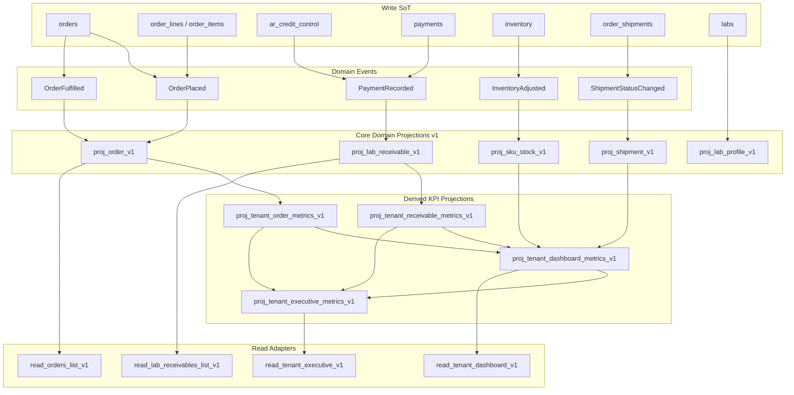

# 18 — Domain Projection Architecture

**Enterprise read layer for PrimeCare ERP — domain-driven, not screen-driven.**

Blueprint refs: [00_System_Architecture.md](./00_System_Architecture.md), [06_Finance_Rules.md](./06_Finance_Rules.md), [12_Executive_Analytics_Rules.md](./12_Executive_Analytics_Rules.md), [15_Do_Not_Break_Rules.md](./15_Do_Not_Break_Rules.md)

Registry: [Projection_Registry.md](../../../docs/Architecture/Projection_Registry.md)

---

## Purpose

Replace transactional fan-out reads with **reusable domain projections** that:

1. Are owned by **business domains**, not UI screens
2. Have a **single grain** per projection (order, lab, SKU, shipment, tenant-day, …)
3. Are refreshed by **domain events** through a projection pipeline
4. Are consumed by **read adapters** (RPC/API) that shape data for screens — projections are never screen-specific tables
5. Version explicitly (`v1`, `v2`) for 10+ year evolution

**Hard rule:** Transactional tables remain write SoT. Projections are read-only derivatives.

---

## Problem with screen-oriented read models

Sprint 2 draft used names tied to consumers:

| Screen-oriented name | Anti-pattern |
|---------------------|--------------|
| `hq_orders_summary_v1` | Implies HQ Orders page ownership; duplicates would appear for Dashboard, EFI, Ops |
| `hq_collections_summary_v1` | Implies Collections page only; EFI/Credit & Risk would re-fetch |
| `get_orders_summary_v1()` | RPC name couples storage to one screen contract |

**Correct pattern:** One **Orders domain** projection at order grain → many **read adapters** for HQ Orders, Dashboard KPIs, EFI, Ops, Agent, Reporting, AI.

---

## Architecture layers

```
┌─────────────────────────────────────────────────────────────────┐
│ WRITE LAYER (SoT) — unchanged                                    │
│ orders │ payments │ ar_credit_control │ inventory │ shipments …  │
└────────────────────────────┬────────────────────────────────────┘
                             │ domain events (append-only)
                             ▼
┌─────────────────────────────────────────────────────────────────┐
│ PROJECTION PIPELINE                                              │
│ Event → Refresh Queue → Worker → Domain Projection Tables        │
└────────────────────────────┬────────────────────────────────────┘
                             │
                             ▼
┌─────────────────────────────────────────────────────────────────┐
│ PROJECTION REGISTRY (domain tables)                              │
│ proj_order_v1 │ proj_lab_receivable_v1 │ proj_sku_stock_v1 …   │
└────────────────────────────┬────────────────────────────────────┘
                             │
              ┌──────────────┼──────────────┐
              ▼              ▼              ▼
        Read Adapters   Derived KPI    Reporting Views
        (RPC per        projections     (rpt_*)
         contract)      (metrics)
              │
              ▼
           UI / BI / AI
```

---

## Naming convention

| Artifact | Pattern | Example |
|----------|---------|---------|
| Domain projection table | `proj_<entity>_v<N>` | `proj_order_v1` |
| Derived KPI projection | `proj_<scope>_<metric>_v<N>` | `proj_tenant_order_metrics_v1` |
| Read adapter RPC | `read_<contract>_v<N>` | `read_orders_list_v1` |
| Reporting view | `rpt_<report>_v<N>` | `rpt_orders_pipeline_v1` |
| Registry entry ID | `PRJ-<DOMAIN>-<GRAIN>-vN` | `PRJ-ORD-ORDER-v1` |

**Sprint 2 rename (required before schema):**

| Sprint 2 draft | Domain projection |
|----------------|-------------------|
| `hq_orders_summary_v1` | **`proj_order_v1`** |
| `hq_collections_summary_v1` | **`proj_lab_receivable_v1`** |
| `get_orders_summary_v1()` | **`read_orders_list_v1()`** (adapter) |
| `get_collections_summary_v1()` | **`read_lab_receivables_list_v1()`** (adapter) |

---

## Domain ownership

| Domain | Owns projections | Write SoT |
|--------|------------------|-----------|
| **Orders** | `proj_order_v1`, order metrics | `orders`, `order_items`, `order_lines` |
| **Collections** | `proj_lab_receivable_v1`, receivable metrics | `ar_credit_control`, `payments`, allocations |
| **Finance** | Invoice status embeds on order projection; invoice detail stays transactional | `invoices`, `invoice_line_items` |
| **Inventory** | `proj_sku_stock_v1`, stock metrics | `inventory`, `inventory_ledger` |
| **Logistics** | `proj_shipment_v1`, dispatch metrics | `order_shipments`, routes |
| **Laboratory** | `proj_lab_profile_v1` | `labs`, qualifications |
| **Distributor** | `proj_distributor_portfolio_v1` | `tenants`, distributor billing |
| **Executive KPI** | Derived only — never duplicates order rows | Aggregates over domain projections |
| **Operations KPI** | Derived only | Aggregates + ops counts |
| **Contracts** | `proj_lab_contract_v1` | `lab_contracts` |
| **Commissions** | `proj_commission_summary_v1` | `commission_entries` |
| **Notifications** | `proj_notification_inbox_v1` | `notification_events` |

---

## Event flow

### Target pipeline (logical — phased implementation)

```
Business Command succeeds (SoT write)
    → append domain_event (idempotent)
        → enqueue projection_refresh_job (event_id, projection_ids[], tenant_id)
            → projection worker (SECURITY DEFINER upsert)
                → proj_* tables updated
                    → read adapter RPC serves UI
```

### Event → projection map (Sprint 2 subset)

| Domain event | Projections refreshed |
|--------------|----------------------|
| `OrderPlaced` | `proj_order_v1`, `proj_tenant_order_metrics_v1` |
| `OrderFulfilled` | `proj_order_v1`, order metrics, `proj_shipment_v1` (hook) |
| `OrderCancelled` | `proj_order_v1`, order metrics |
| `PaymentRecorded` | `proj_lab_receivable_v1`, receivable metrics |
| `PaymentAllocated` | `proj_lab_receivable_v1`, order invoice embed |
| `CreditStatusChanged` | `proj_lab_receivable_v1` |

### Refresh strategy

| Mode | When | Use |
|------|------|-----|
| **Incremental (row)** | After each domain event | Primary — upsert one grain row |
| **Invalidation signal** | Client post-write | Bust read-adapter cache only |
| **Scheduled sweep** | Every 5 min per tenant | Missed event recovery |
| **Full rebuild** | Deploy, parity fail, manual | `rebuild_projection_v1(tenant, projection_id)` |
| **On-demand read** | Detail drawer only | Transactional SoT — never list/dashboard |

### Retry strategy

| Setting | Value |
|---------|-------|
| Delivery | At-least-once |
| Idempotency key | `{tenant_id}:{event_type}:{entity_id}:{event_version}` |
| Max retries | 5 exponential backoff |
| Dead letter | `projection_refresh_dlq` (future table) + alert |
| Ordering | Per entity grain (order_id, lab_id) — serial per key |

### Failure recovery

1. Worker fails → job requeued with backoff
2. After max retries → DLQ + `hq_projection_meta_v1.last_error`
3. Scheduled sweep rebuilds stale projections
4. Parity script fails → flag OFF + optional auto-rebuild
5. **Never** fall back to mixing projection + transactional KPIs without `degraded: true` flag

### Versioning

- New grain or breaking field → new table `proj_*_v2` parallel run
- Shadow parity 14 days minimum
- Read adapters accept `p_version` default `1`
- Retire v1 after cert + 30-day parallel

---

## Shared projections (no per-screen tables)

### Order projection — single source for all order list KPIs

**`proj_order_v1`** (grain: one row per order)

| Consumer | Access pattern |
|----------|----------------|
| HQ OrdersPage | `read_orders_list_v1` |
| Admin Dashboard pending count | `read_tenant_order_metrics_v1` (derived) |
| Operations Center | metrics adapter |
| Executive / EFI | metrics + top-N adapters |
| Revenue Funnel | same projection, different filter |
| Agent portal | scoped adapter (RLS + agent filter) |
| Reporting | `rpt_orders_pipeline_v1` |
| AI / Analytics | batch export of projection |

**Do not create:** `hq_orders_summary`, `dashboard_orders`, `efi_orders`, `ops_orders`.

### Lab receivable projection — single source for collections

**`proj_lab_receivable_v1`** (grain: one row per lab)

| Consumer | Access pattern |
|----------|----------------|
| CollectionsPage | `read_lab_receivables_list_v1` |
| Credit & Risk | same adapter, risk filter |
| EFI collections section | metrics adapter |
| Admin Dashboard receivables KPI | `read_tenant_receivable_metrics_v1` |
| Agent collections | scoped adapter (0 staleness SLA) |
| Reporting | `rpt_collections_aging_v1` |

---

## Projection dependency diagram



**Dependency rules**

1. Derived projections **never** read SoT directly at query time — only core projections or events
2. UI **never** reads SoT for list/dashboard initial load when projection flag ON
3. Detail drawers may read SoT (single entity)
4. Acyclic: Derived → Core → Events → SoT

---

## Staleness & certification

| Projection class | Default SLA | Agent exception |
|------------------|-------------|-----------------|
| Core domain (order, lab receivable) | 60 s | Agent receivables: **0 s** (transactional adapter or sync refresh) |
| Tenant metrics | 90 s | — |
| Executive metrics | 180 s | — |

Certification: [Projection_Registry.md](../../../docs/Architecture/Projection_Registry.md), `verify-projection-parity.mjs` (planned), `08_Read_Model_Certification_Matrix.md` (planned).

---

## Feature flags (read adapters, not projections)

| Flag | Controls |
|------|----------|
| `VITE_READ_ADAPTER_ORDERS_V1` | `read_orders_list_v1` vs `getOrdersRead` |
| `VITE_READ_ADAPTER_RECEIVABLES_V1` | `read_lab_receivables_list_v1` vs `getCollectionsRead` |

Projection tables may exist while flags OFF (shadow mode).

---

## 5-year projection roadmap

### Phase 1 — Core domain projections (Year 1 Q3)

- `proj_order_v1`, `proj_lab_receivable_v1`
- Event pipeline v0 (client-triggered refresh + scheduled sweep)
- Parity certification

### Phase 2 — Inventory & Logistics (Year 1 Q4)

- `proj_sku_stock_v1`, `proj_shipment_v1`
- `proj_tenant_order_metrics_v1`, `proj_tenant_receivable_metrics_v1`

### Phase 3 — Dashboard & Executive KPI (Year 2 H1)

- `proj_tenant_dashboard_metrics_v1`, `proj_tenant_executive_metrics_v1`
- Deprecate dashboard line fan-out and EFI mega-loader

### Phase 4 — Reporting, Forecasting, AI (Year 2–3)

- `rpt_*` views on projections only
- `proj_analytics_signals_v1` (batch)
- Reorder/demand forecast projections

### Phase 5 — Data warehouse & analytics (Year 3–5)

- CDC / ETL from projection tables to warehouse
- Multi-distributor consolidation projections
- White-label tenant analytics partition

---

## Sprint 2 alignment

Sprint 2 implements **Phase 1 core projections only** with domain names:

1. Schema: `proj_order_v1`, `proj_lab_receivable_v1`, `hq_projection_meta_v1`
2. Adapters: `read_orders_list_v1`, `read_lab_receivables_list_v1`
3. Workers: `refresh_proj_order_row_v1`, `refresh_proj_lab_receivable_row_v1`
4. **Do not** ship dashboard or executive derived projections in Sprint 2

See [Projection_Registry.md](../../../docs/Architecture/Projection_Registry.md) for full catalog.

---

## Do-not-break

- F1, F4: Order and AR SoT unchanged
- D1, D2: RLS on projections mirrors SoT visibility
- Projections are **read-only** for all authenticated roles
- Lab portal list reads remain lab-scoped transactional until Lab domain adapter exists

---

## Related documents

- [Projection_Registry.md](../../../docs/Architecture/Projection_Registry.md)
- [16_Certification_Framework.md](./16_Certification_Framework.md)
- [Technical_Debt_Register.md](../../../docs/Architecture/Technical_Debt_Register.md)
- Sprint 2 plan (conversation / QA docs) — **must rename** before implementation
