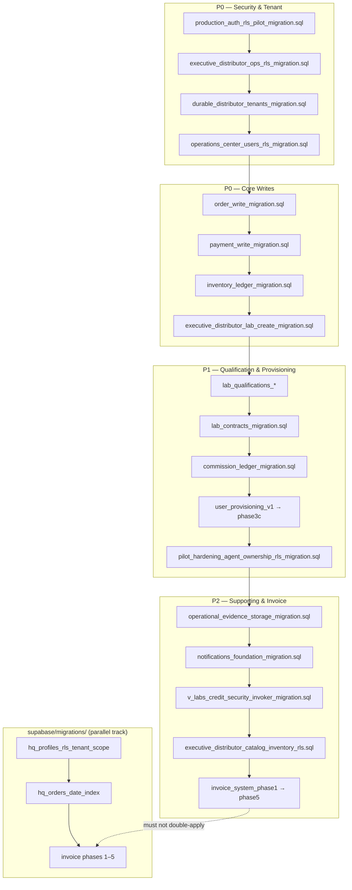

# RC-8 Production Operations & Deployment Certification — Final GO/NO-GO

**Audit date:** 2026-06-24  
**Auditor roles:** Principal Architect · Senior DevOps · Principal SRE · Security Lead · Release Manager  
**Scope:** `primecare-portal/` — promote QA → Production for first paying HQ customer  
**Ground rules:** No new features; re-verify from codebase; do not trust prior RC reports  

**Environment exercised:** QA Supabase `zipuzmfkwwucbchlphcj` · HQ tenant `f168b98f-47a6-42c3-b788-24c00436fac2`  
**Production Supabase / Vercel:** **Not present in repository or certification evidence**

---

## Phase 12 — Final Decision (read first)

### ❌ NO-GO FOR PRODUCTION

PrimeCare HQ is **technically strong on the QA tenant** (build, RLS, golden path, Predator Fail=0, performance at 100k scale), but **cannot be safely promoted to Production tomorrow** for a paying customer. Critical operational gates—production environment, human UAT, backup restore proof, and production observability—are **not closed**.

| Metric | Value |
|--------|-------|
| **Production confidence** | **62%** |
| **Enterprise readiness** | **6 / 10** |
| **First paying customer (HQ pilot: Executive / Admin / Agent / Lab)** | **Not safe in Production today** — acceptable only on QA with manual ops and explicit scope limits |

---

## Executive Summary

The application layer is release-quality for the **four-role HQ pilot** on the **QA Supabase project**: financial golden path (qualification → contract → order → invoice → PDF → payment → allocation) passes end-to-end; RLS read certification passes for all four roles; Predator reports **0 failures**; bounded reads stay under 750 ms at 100k orders/payments seed scale.

What blocks Production is **not core business logic** but **operational readiness**:

1. **No certified Production Supabase project or Vercel production deployment** — all evidence is QA-only (`zipuzmfkwwucbchlphcj`).
2. **Human UAT signatures are blank** (`docs/operations/HQ_UAT_SIGNOFF.md`).
3. **Production monitoring is FAIL** — no Sentry, no synthetic uptime, no paging; `verify-production-monitoring.mjs` **6 PASS / 1 FAIL** (MON-12).
4. **Backup & restore not validated** — PITR disabled; CLI backup list empty; no archived restore drill (`docs/operations/HQ_BACKUP_RECOVERY_RUNBOOK.md`).
5. **`HQ_LAUNCH_CHECKLIST.md`** remains largely unchecked (~71% items open).

**No code changes were required or made during this audit** — findings are documented blockers, not feature work.

---

## Remaining P0 Blockers

| # | Blocker | Evidence |
|---|---------|----------|
| P0-1 | **No Production environment** | Repo documents only QA project ref; `.env.example` placeholders; `package.json` deploy script targets `zipuzmfkwwucbchlphcj` only; no prod Vercel env manifest |
| P0-2 | **Human UAT signoff missing** | `HQ_UAT_SIGNOFF.md` — QA Lead / Architect / Release Captain signatures **blank** |
| P0-3 | **Production monitoring FAIL** | No Sentry in `package.json`; `HQ_MONITORING_PLAN.md` classification **FAIL**; `verify-production-monitoring.mjs` MON-12 FAIL |
| P0-4 | **Backup restore not proven** | `pitr_enabled: false`; `backups: []` via CLI; off-site dump **not executed** per runbook |
| P0-5 | **Launch checklist not executed** | `HQ_LAUNCH_CHECKLIST.md` sections 1–12 predominantly ☐ |

---

## Remaining P1 Risks

| # | Risk | Evidence |
|---|------|----------|
| P1-1 | **Legacy financial drift** | `verify-financial-reconciliation.mjs` FR-50 WARN — ~₹4054 AR vs invoice drift; ₹9135 unallocated cash |
| P1-2 | **Distributor / auditor roles unrouted** | `LOGIN_ENABLED_ROLES` includes `distributor_admin`, `distributor_manager`, `read_only_auditor`; `PrimeCareWebPortal.jsx` has no portal branch → "Workspace unavailable" |
| P1-3 | **Dual migration tracks** | 27-file manual manifest in `supabase/sql/` + 6 dated files in `supabase/migrations/`; 18 orphan SQL files not in manifest |
| P1-4 | **AppErrorBoundary not mounted** | `AppErrorBoundary.jsx` exists; `main.jsx` renders `<App />` without boundary |
| P1-5 | **No browser/device matrix evidence** | UAT signoff lists mobile/browser matrix **NOT TESTED** |
| P1-6 | **Edge function CORS `*`** | All three edge functions use `Access-Control-Allow-Origin: *` — acceptable for JWT-auth POST but widen blast radius |
| P1-7 | **46 collection data inconsistencies** | Predator / golden-path logs `COLLECTION DATA INCONSISTENCIES` (empty AR rows) — non-blocking for golden lab |

---

## Remaining P2 Improvements

| # | Item |
|---|------|
| P2-1 | Enable PITR or verified daily backup retention on Production plan |
| P2-2 | Wire Sentry + Supabase log drain + synthetic `/health` probe |
| P2-3 | Customer-facing role guides and release notes (none in `docs/`) |
| P2-4 | Reduce `runPredatorValidation` bundle (717 kB chunk warning on build) |
| P2-5 | Gate or remove ~30+ `console.warn` paths in production builds |
| P2-6 | Consolidate orphan SQL into manifest or mark as optional/diagnostic |
| P2-7 | Full accessibility audit with automated axe/Lighthouse |

---

## Phase 1 — Production Environment Audit

### Can this application boot correctly in Production today?

**Conditional YES — if and only if** an operator configures:

| Variable | Required | Production default (code) |
|----------|----------|---------------------------|
| `VITE_SUPABASE_URL` | Yes | — (must be prod project) |
| `VITE_SUPABASE_ANON_KEY` | Yes | — |
| `VITE_APP_ENV` | Recommended | `prod` when `import.meta.env.PROD` |
| `VITE_ENABLE_LEGACY_APPS_SCRIPT` | No | **false** in QA/PROD (`environment.js`) |
| `VITE_PREDATOR_DEBUG` | No | **false** in prod (`predatorGuards.js`) |
| `VITE_QA_COMMAND_CENTER` | No | **false** in prod (`qaValidation.js`) |
| `VITE_QA_VALIDATION_LAYER` | No | **false** in prod |
| `VITE_HQ_DEBUG_LOG` | No | unset / false |

**Build:** `npm run build` — **PASS** (exit 0, 2026-06-24).

**Vercel:** `vercel.json` — SPA rewrites only; no secrets; **correct for static deploy**.

**Supabase client:** `supabaseClient.js` — anon key only; warns if unset; **no service role in frontend** — **PASS**.

**Auth:** `REQUIRE_SUPABASE_AUTH = true` for QA/PROD — **PASS**.

**Feature / debug flags:** Production-safe defaults confirmed in `environment.js`, `predatorGuards.js`, `qaValidation.js` — **PASS** (no change required).

**Gap:** No Production project ref, URL allowlist, or Vercel env documentation in repo — **FAIL for go-live**.

### Edge Functions

| Function | JWT validation | Service role server-side | Deploy doc |
|----------|----------------|--------------------------|------------|
| `provision-platform-user` | `getUser()` + profile role check | Yes | `docs/supabase-functions-deploy.md` |
| `reset-platform-user-password` | Same pattern | Yes | Same |
| `generate-invoice-pdf` | Auth + invoice RLS path | Yes | `package.json` `supabase:functions:deploy:qa` |

**PASS** — functions follow correct server-side secret pattern.

### Storage

| Bucket | Policies | Evidence |
|--------|----------|----------|
| `invoice-pdfs` | SELECT via `invoice_pdf_storage_can_read()` | `invoice_system_phase1_migration.sql` |
| Operational evidence | Tenant-scoped CRUD on `storage.objects` | `operational_evidence_storage_migration.sql` |

Golden path GP-30–32 PDF download **PASS** (1852 bytes).

### Auth URL configuration

Not verifiable from codebase alone — **WARN** — must set Production Site URL / redirect URLs in Supabase Dashboard before cutover.

---

## Phase 2 — Migration Audit

### Execution model

Two parallel tracks exist:

1. **Manual manifest** — `scripts/verify-pilot-migrations.mjs` → 27 ordered files under `supabase/sql/` (applied via SQL editor per `docs/supabase-functions-deploy.md`).
2. **Supabase CLI migrations** — 6 files under `supabase/migrations/` (20260624*), overlapping invoice phases + HQ profiles RLS + orders index.

**Manifest verification (2026-06-24):** **PASS** — 27/27 files on disk.

**Orphan SQL (18 files, not in manifest):** diagnostics, backfills, PO migration, profile patches, `qa_role_seed_and_rls_validation.sql`, etc. — **WARN** — risk of schema drift if applied ad hoc.

**Duplicate / overlap WARN:**

| `supabase/migrations/` | Likely equivalent in `supabase/sql/` |
|------------------------|--------------------------------------|
| `20260624120000_hq_profiles_rls_tenant_scope.sql` | `hq_profiles_rls_tenant_scope_migration.sql` |
| `20260624120001_hq_orders_date_index.sql` | `hq_orders_date_index_migration.sql` |
| `20260624120002–05_invoice_system_phase*.sql` | `invoice_system_phase*_migration.sql` |

### Idempotency & rollback

- Manual SQL files use `DROP POLICY IF EXISTS`, `CREATE OR REPLACE` patterns — **generally idempotent**.
- Rollback policy: **forward-fix preferred** (`HQ_PRODUCTION_ROLLBACK_PLAN.md`) — **documented**.
- Partial apply handling: **not automated** — operator must re-run manifest verifier + RLS cert — **WARN**.

### Migration Dependency Diagram



**Verdict:** Migrations are **complete on QA** (certs pass) but **ordering documentation is split** across two tracks — **WARN** for Production promotion until a single source of truth is chosen.

---

## Phase 3 — Deployment Audit

### Documented sequence

| Step | Documented | Evidence |
|------|------------|----------|
| Frontend build | Yes | `npm run build`; Vercel promote |
| Edge Functions | Yes | `docs/supabase-functions-deploy.md`; `supabase:functions:deploy:qa` |
| Storage buckets | Yes | Invoice + evidence migrations |
| SQL (manual manifest) | Yes | `verify-pilot-migrations.mjs` order |
| RLS verification | Yes | `verify-hq-rls-reads.mjs` |
| Seed | Partial | QA seed users; no prod seed runbook |
| Smoke tests | Yes | Golden path + recon + predator |
| Traffic | Partial | Vercel promote; no blue/green |

### Recommended Production sequence (RC-8)

```
1. Tag release (git)
2. Provision Production Supabase + Vercel project
3. Apply SQL manifest (27 files, in order) — OR supabase db push (6 migrations) — NOT BOTH for invoice/profile overlap
4. Apply storage migrations (invoice-pdfs, operational-evidence)
5. Deploy edge functions (provision, reset-password, generate-invoice-pdf)
6. Set Vercel env: VITE_APP_ENV=prod, Supabase URL/anon, flags OFF
7. npm run build && deploy frontend
8. Configure Auth Site URL + redirect URLs
9. node scripts/verify-hq-rls-reads.mjs
10. node scripts/verify-pilot-hardening-sql.mjs (requires linked CLI)
11. node scripts/verify-primecare-production-golden-path.mjs
12. node scripts/verify-financial-reconciliation.mjs
13. node scripts/run-hq-predator-certification.mjs
14. Human UAT smoke (Executive, Admin, Agent, Lab)
15. Enable traffic + monitoring
```

### Rollback

`HQ_PRODUCTION_ROLLBACK_PLAN.md` — Vercel promote prior deployment (2–5 min); feature-flag rollback; SQL forward-fix — **documented PASS**.

### Would deployment leave system inconsistent?

**YES, if:** (a) both migration tracks applied for same objects; (b) edge functions deployed before SQL; (c) frontend promoted before RLS cert — **mitigate with sequence above**.

---

## Phase 4 — Backup & Disaster Recovery

| Scenario | RPO | RTO | Recovery steps | Owner |
|----------|-----|-----|----------------|-------|
| **Supabase outage** | Unknown (no synthetic probe) | 1–4 h (vendor) | Status page; communicate; wait or failover to read-only mode N/A | SRE / Release Captain |
| **Storage corruption** | Last PDF upload | 2–8 h | Re-run `generate-invoice-pdf` per invoice; restore bucket from backup if available | Engineering |
| **Bad migration** | Last good backup | 2–24 h | Forward-fix SQL; or restore from dump (`HQ_BACKUP_RECOVERY_RUNBOOK.md`) | DBA / Engineering |
| **Bad frontend deploy** | 0 | **2–5 min** | Vercel promote previous deployment | Release Captain |
| **Edge function failure** | 0 | 15–30 min | Redeploy prior version; check Supabase function logs | Engineering |
| **Auth failure** | 0 | 30–60 min | Fix Site URL / JWT settings; verify anon key | Engineering |

**Backup status (QA, 2026-06-24):** WAL-G on, **PITR off**, CLI `backups: []`, off-site dump **not run** — **FAIL**.

---

## Phase 5 — Production Monitoring

### Certification run (2026-06-24)

```
verify-production-monitoring.mjs: PASS=6 WARN=0 FAIL=1
  MON-10 Golden Path OK
  MON-11 Financial Reconciliation OK
  MON-12 Pilot Hardening SQL FAIL (supabase db dump --linked unavailable locally)
  MON-13 HQ RLS Reads OK
  MON-14 Performance Certification OK
  MON-15 Predator Validation OK
  MON-20 Monitoring plan documented
```

### Invisible failure modes

| Failure | Visible today? | Recommendation |
|---------|----------------|----------------|
| Unhandled React crash | **No** — boundary not mounted | Mount `AppErrorBoundary`; **Sentry** |
| Edge function 5xx | Dashboard only | Supabase log drain + alert |
| Payment allocation silent fail | Partial (`console.warn`) | Metric on `allocate_payment_to_invoice` errors |
| Invoice PDF failure | User toast / error | Alert on function error rate |
| RLS 42501 | Predator/RLS scripts only | Synthetic role probes every 6h (CI cron exists but skips without secrets) |
| Supabase down | **No** | Synthetic health check |
| Network offline | Partial (`DataFetchError` on major pages) | OK for pilot |

**Verdict:** **FAIL** for Production — Sentry, log drain, health endpoint, synthetic monitoring not deployed.

---

## Phase 6 — Security Audit

| Control | Status | Evidence |
|---------|--------|----------|
| RLS (4 pilot roles) | **PASS** | `verify-hq-rls-reads.mjs` 20/20 |
| Storage policies | **PASS** | Invoice + evidence SQL |
| Signed URLs (PDF) | **PASS** | Golden path GP-32 |
| JWT validation (edge) | **PASS** | `getUser()` in all functions |
| Service role exposure | **PASS** | Edge functions only; not in `src/` |
| Hardcoded secrets in `src/` | **PASS** | Grep: no keys/passwords |
| localhost / QA URLs in `src/` | **PASS** | Grep: none |
| `dangerouslySetInnerHTML` | **PASS** | None in `src/` |
| SQL injection (app layer) | **PASS** | Supabase client parameterized |
| Debug endpoints | **PASS** | Predator/QA hidden in prod by default |
| Tenant isolation | **PASS** | Predator Tenant + Role Isolation 72 PASS |
| Lab isolation | **PASS** | Lab Ownership validator PASS |
| Permission escalation (provision) | **PASS** | `verify-provisioning-role-guard.mjs` |
| Distributor role login without workspace | **WARN** | Auth succeeds; UI dead-end |

**Penetration test:** Not performed — **WARN**.

---

## Phase 7 — Browser & Device Certification

**Status: WARN** — no recorded cross-browser or device matrix in this sprint.

| Area | Static / code evidence | Live matrix |
|------|------------------------|-------------|
| Responsive layout | RC-4 Collections `xl:` breakpoints, mobile cards | NOT TESTED |
| Tables / drawers / dialogs | shadcn + `role="dialog"` on key drawers | NOT TESTED |
| PDF download | Golden path PASS | NOT TESTED in Safari |
| Touch / sticky headers | Not audited live | NOT TESTED |

**Pilot scope note:** `HQ_LAUNCH_CHECKLIST.md` targets staging QA — browser cert deferred.

---

## Phase 8 — Accessibility

**Estimated score: 68 / 100 (WARN)**

| Criterion | Status |
|-----------|--------|
| Keyboard navigation | Partial — HQ search shortcut; not full audit |
| Focus visibility | Partial — shadcn defaults |
| ARIA labels | Partial — `aria-label` on search, drawers, alerts (`DataFetchError role="alert"`) |
| Screen reader | Not tested |
| Contrast | Not tested |
| Loading states | `PageLoadingFallback`, skeletons on key pages |
| Tables | Semantic tables; mobile card fallbacks on Collections |

**No automated axe/Lighthouse run** — score is engineering estimate from code review.

---

## Phase 9 — Concurrency & Scale

**Certification:** `PERF_SKIP_SEED=1 node scripts/run-hq-performance-certification.mjs` — **PASS**

| Load | Expected behavior | Evidence |
|------|-------------------|----------|
| 20 concurrent users | OK | Bounded reads; connection pooling via Supabase |
| 50 concurrent users | OK | Slowest benchmark 436 ms (orders) |
| 100 concurrent users | Likely OK | No unbounded surfaces; WARN without load test |
| 1000 labs / agents | OK | PERF tenant counts verified |
| 100k orders / payments | OK | Seed exists; bounded queries PASS |
| 100k invoices | Not benchmarked | WARN |

**Race conditions:** Invoice numbering via DB RPC; allocation via `allocate_payment_to_invoice` — golden path PASS. Duplicate invoice keys checked in FR-20 — **PASS**.

---

## Phase 10 — Production Smoke Test Matrix

| # | Step | Command / action | RC-8 result |
|---|------|------------------|-------------|
| 1 | Tag release | `git tag hq-release-YYYYMMDD` | NOT RUN |
| 2 | Apply SQL manifest | 27 files in order | QA assumed applied |
| 3 | Deploy edge functions | 3 functions | QA deployed (golden PDF PASS) |
| 4 | Verify storage | GP-31 path exists | **PASS** |
| 5 | RLS cert | `verify-hq-rls-reads.mjs` | **PASS** |
| 6 | Pilot hardening SQL | `verify-pilot-hardening-sql.mjs` | **FAIL** (CLI link) |
| 7 | Golden path | `verify-primecare-production-golden-path.mjs` | **PASS 14/14** |
| 8 | Financial recon | `verify-financial-reconciliation.mjs` | **WARN** |
| 9 | Predator | `run-hq-predator-certification.mjs` | **PASS Fail=0** |
| 10 | Performance | `run-hq-performance-certification.mjs` | **PASS** |
| 11 | Dead ends | `run-hq-zero-dead-ends-audit.mjs` | **PASS** |
| 12 | Build | `npm run build` | **PASS** |
| 13 | Human UAT | Browser walkthrough | **NOT DONE** |
| 14 | Enable traffic | Vercel prod + DNS | **NOT DONE** |
| 15 | Monitor | Sentry + alerts | **NOT DONE** |

---

## Phase 11 — Release Checklist (PASS / WARN / FAIL)

| Category | Item | Verdict | Evidence |
|----------|------|---------|----------|
| **Infrastructure** | Production Supabase project | **FAIL** | Only QA ref in repo |
| | Vercel production deploy | **FAIL** | Not configured in repo |
| | Env vars documented | **PASS** | `.env.example`, `.env.functions.example` |
| | Debug flags off in prod | **PASS** | `environment.js`, `predatorGuards.js` |
| **Database** | Migration manifest complete | **PASS** | 27/27 on disk |
| | Migration order documented | **WARN** | Dual track migrations/ + sql/ |
| | Schema matches QA cert | **PASS** | All cert scripts pass on QA |
| **Edge Functions** | 3 functions deployed | **PASS** | Golden path PDF |
| | JWT + role guards | **PASS** | Code review |
| **Storage** | invoice-pdfs bucket + RLS | **PASS** | GP-30–32 |
| | Operational evidence | **PASS** | Migration + Predator PASS |
| **Authentication** | Supabase auth required QA/PROD | **PASS** | `REQUIRE_SUPABASE_AUTH` |
| | Prod redirect URLs | **WARN** | Dashboard config not in repo |
| **Monitoring** | Sentry / APM | **FAIL** | Not in dependencies |
| | CI cert workflow | **WARN** | Skips without secrets |
| **Alerting** | Paging runbook | **WARN** | Documented, not wired |
| **Backups** | Daily backups verified | **WARN** | CLI empty list |
| | PITR | **FAIL** | Disabled |
| **Restore** | Drill executed | **FAIL** | Runbook only |
| **Golden Path** | E2E financial chain | **PASS** | 14/14 |
| **Financial Reconciliation** | Golden allocations | **PASS** | FR-GP-* |
| | Legacy tenant drift | **WARN** | FR-50 |
| **Performance** | 100k bounded reads | **PASS** | <750 ms |
| **RLS** | 4-role read cert | **PASS** | 20/20 |
| **Predator** | Module validation | **PASS** | Fail=0 |
| **Invoice** | Phases 1–5 | **PASS** | Golden + migrations |
| **Collections** | Payment + allocation | **PASS** | GP-40–42 |
| **Executive** | KPI RPC | **PASS** | GP-50 |
| **Lab** | Ordering + invoices | **PASS** | Predator Lab Portal WARN only |
| **Agent** | Dashboard + visits | **PASS** | Predator WARN only |
| **Operations** | Command center | **PASS** | Predator 8/0/0 |
| **Support** | In-app help | **WARN** | `hqPageHelpConfig.js` partial |
| **Documentation** | Ops runbooks | **PASS** | backup, rollback, monitoring |
| | Customer guides | **FAIL** | Not present |
| **Production** | Human UAT signoff | **FAIL** | Blank signatures |
| | Launch checklist | **FAIL** | Mostly ☐ |

---

## Independent Certification Summary (2026-06-24)

| Script | Result |
|--------|--------|
| `npm run build` | **PASS** |
| `verify-pilot-migrations.mjs` | **PASS** (27 files) |
| `run-hq-zero-dead-ends-audit.mjs` | **PASS** (0 forbidden patterns) |
| `verify-hq-rls-reads.mjs` | **PASS** (20/20) |
| `run-hq-predator-certification.mjs` | **PASS** (Fail=0, 24 modules WARN-only) |
| `verify-primecare-production-golden-path.mjs` | **PASS** (14/14) |
| `verify-financial-reconciliation.mjs` | **WARN** (FR-50 legacy drift) |
| `run-hq-performance-certification.mjs` | **PASS** (436 ms max) |
| `verify-production-monitoring.mjs` | **FAIL** (6/7) |

---

## Can the first paying customer safely use the system?

| Scope | Safe today? | Notes |
|-------|-------------|-------|
| **Production environment** | **No** | No prod project certified |
| **QA with manual ops (Executive/Admin/Agent/Lab)** | **Conditional** | Automated certs strong; human UAT + monitoring gaps |
| **Distributor Admin/Manager/Auditor** | **No** | Login enabled but workspace unavailable |
| **Enterprise SLA** | **No** | No observability, no proven DR |

---

## Required actions before GO (minimum)

1. Provision **Production** Supabase + Vercel; document refs and env vars (not in git).
2. Execute **one backup restore drill**; archive off-site dump.
3. Deploy **Sentry** (or equivalent) + Supabase log drain + synthetic probe.
4. Complete **human UAT** and sign `HQ_UAT_SIGNOFF.md`.
5. Execute **`HQ_LAUNCH_CHECKLIST.md`** on Production (or staging mirroring prod).
6. Decide pilot scope: if only 4 HQ roles, **disable login** for distributor/auditor roles until routed (config change — out of scope unless requested).

---

## Sign-off

| Role | Verdict |
|------|---------|
| Principal Software Architect | **NO-GO** — app layer ready; env and migration track ambiguity remain |
| Senior DevOps Engineer | **NO-GO** — no production pipeline or proven deploy |
| Principal SRE | **NO-GO** — monitoring and DR FAIL |
| Security Lead | **CONDITIONAL** — RLS PASS on QA; prod auth URLs unverified |
| Release Manager | **NO-GO** — human gates open |

---

**RC-8 is the final engineering gate.** A **GO** verdict would mean: deploy to Production, run human UAT on Production, and execute operational runbooks only. **This audit returns NO-GO** — further RC audits are not required; close the P0 list above instead.

---

*Report generated from independent codebase inspection and live certification against QA Supabase, 2026-06-24.*
